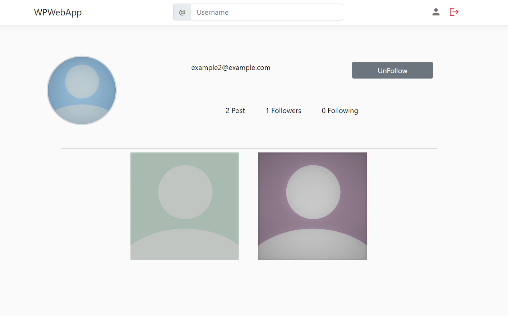

# 📄About The Project
This project is a social media application. Users can follow each others and share their photo on the application. When a user follow other users, it can see their photo on own main page and it can add emoji under the photo.

The application has role based authorization. There are two users role including admin and application user in the application.

# 🔑Features of The Users
## 👩👨 **Application User**
* can create a new account.
* can follow each others.
* can share photo.
* can add emoji under photos.
* can remove emoji added by itself.
## 👩‍💻👨‍💻 **Admin**
* has all features of application user.
* can read/create/update/delete users.

# 💻Used Technologies
|Technologies|
|:---:|
|.net core|
|Entity Framework|
|MVC|
|Git|
|GitHub|
|MSSQL|
|Entity Famework Migration|
|Javascript|
|jQuery Ajax|

# 📚Used Methods
|Methods|
|:---:|
|Authentication|
|Authorization|
|Dependency Injection|
|IoC|
|Code First|
|Globalization Localization|
|GUID (for photos)|

# 📋Images From Application
* ## Login And Register

---

* ## Profiles

---

* ## Multi Language

---

* ## Admin Page

